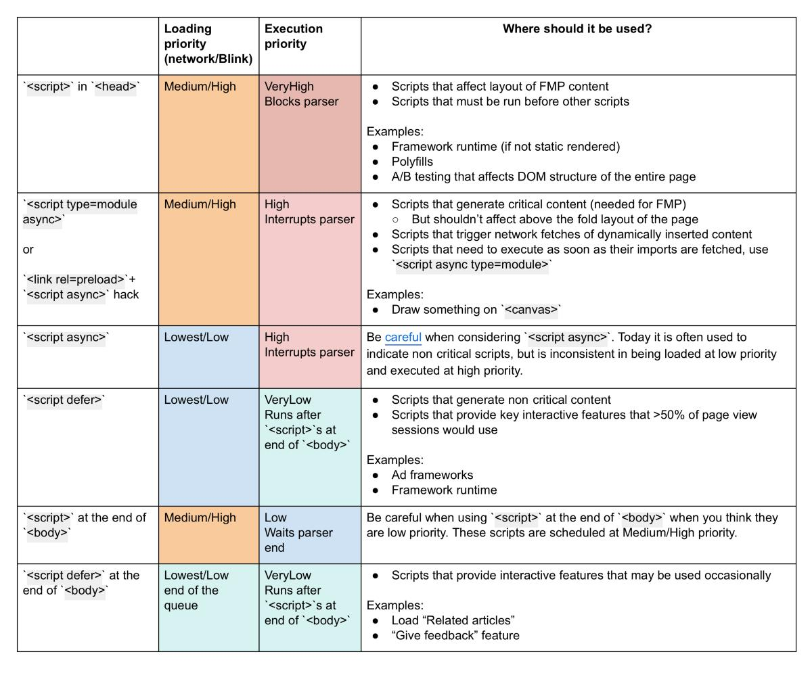

import Slider from '../../../src/components/slider'


<Slider>

# Hello

# Slide 2

</Slider>


<!-- ## learnreact.design

https://learnreact.design/tips/children-connectors/


```js react-live
<h1>Edit me</h1>
<button className="">Beep</button>
``` -->

<!--
<Slider slide1="first" slide2={} slide3="third" slide4="fourth" />
-->


<!--  -->

