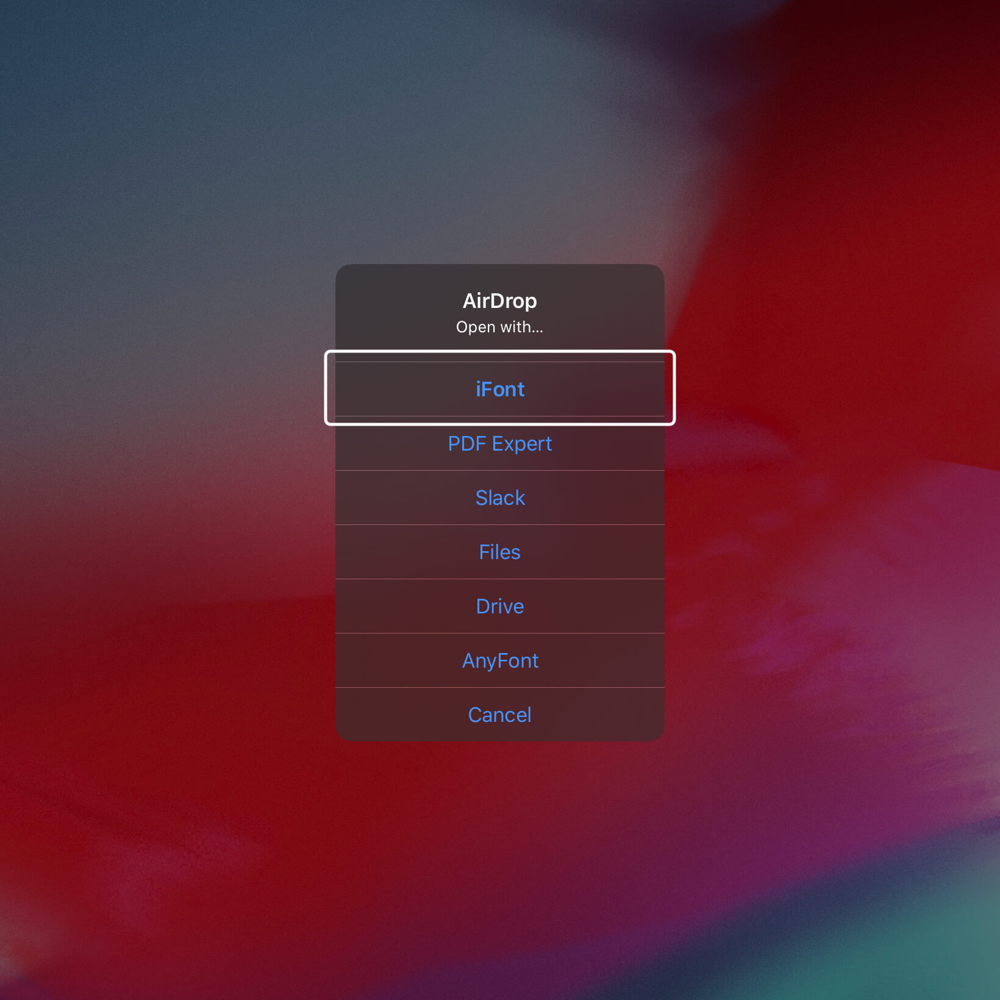
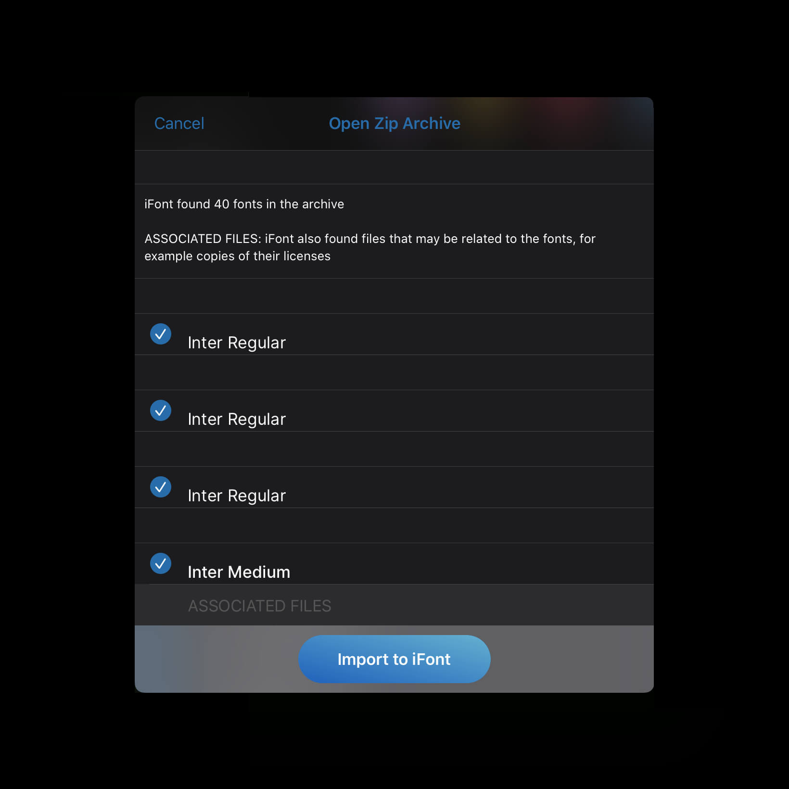

import ReactPlayer from "react-player"
import {Grid} from "@theme-ui/components"

<ReactPlayer url="/custom-fonts-on-ipad.mov" controls={true} width="100%" />
 

In the video, I install [Inter typeface](https://rsms.me/inter/) with [AnyFont app](https://apps.apple.com/us/app/anyfont/id821560738) _($1.99)_ and then use it in [Affinity Designer](https://apps.apple.com/us/app/affinity-designer/id1274090551).

> Developers of [AnyFont](https://anyfont.app/) and iFont leverage iOS ability to install third-party Configuration Profiles. Installing uncertified Configuration Profiles comes at risk!    

## Here's how you can use all those fancy typefaces on your iPad

1. Upload `.otf` files of typeface you want to use to iCloud, DropBox, or transfer it to Files via AirDrop. AnyFont and iFont also allow you to download fonts directly from DaFont, FontSpring, and more.
2. Open AnyFont and select the source you want to add fonts from - in my case, it's iCloud Drive. Once you add the font, select it, and tap Install. A prompt to download a Configuration Profile will appear, tap allow.
3. Open up Settings on your iPad, and you should see a "Profile Downloaded" in the top left corner underneath your Apple ID profile. Select it and tap "Install". It'll ask you to enter a passcode and a couple "Are you sure?" dialogues will pop up.

You can always remove Configuration Profiles you've installed. 

## Bulk Install
For installing more than one font, I found out that [iFont](https://apps.apple.com/dk/app/ifont-find-install-any-font/id1173222289?l=da) works better than AnyFont. 

1. Put .otf files in a ZIP
2. AirDrop the zip onto an iPad, and open it up with iFont app which then asks you to select individual font files to import:

<Grid columns={2}>

</Grid>

iFont will then ask you to install Configuration Profile for each font, which is only possible to do one-by-one. And that's probably for the best. 🙃

### Resources

- [AnyFont for iOS](https://apps.apple.com/us/app/anyfont/id821560738)
- [iFont for iOS](https://apps.apple.com/us/app/ifont-find-install-any-font/id1173222289)
- Script inspired by the AnyFont app: [FontInstaller.py (https://gist.github.com/omz/9901460)](https://gist.github.com/omz/9901460) 