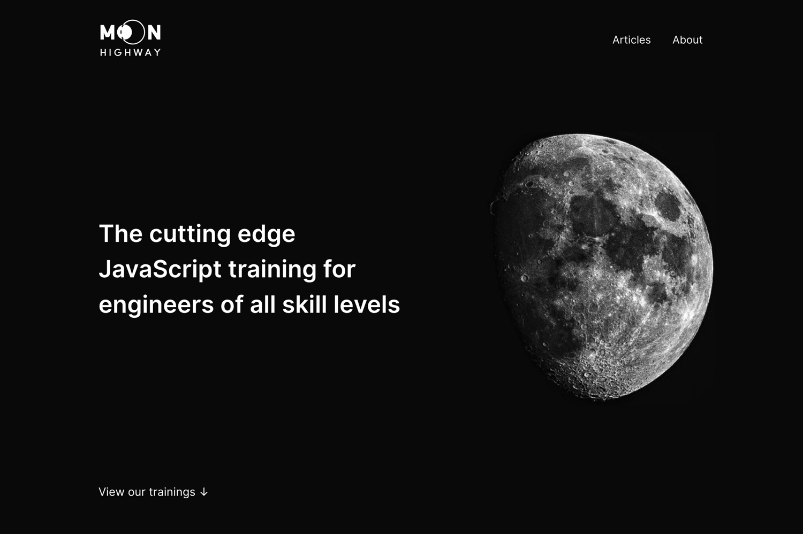
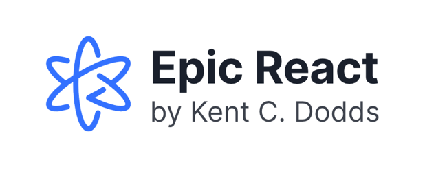

import { Image, Flex, Box, Grid, Link } from "@theme-ui/components"
import EpicReactLogo from "./assets/epicreact"

Logotypes and branding projects have never been my primary field of focus. But whenever I get a chance, I enjoy helping folks who are starting a new business or are passionate about what they do. Here’s a collection of selected marks I got to design for them.

 

## Modular logomark for GAP

[GAP / Galerie a Prostor](https://galerieaprostor.cz), or Gallery and Space in English, is a project by Art to Znojmo association, which combines a gallery of contemporary art with a coffee shop, situated in the historical city center of Znojmo.

<Grid columns={2} my={3}>

<Flex sx={{py: 4, border: '1px solid #f1f1f1', alignItems: 'center', justifyContent: 'center', width: '100%', img: {m: 0}}}>

<Image
  src="./assets/gap@2x.gif"
  alt="Animated logo for galerieaprostor.cz"
  width="400px"
  sx={{ width: 200 }}
/>

</Flex>

<Box sx={{py: 4, border: '1px solid #f1f1f1', alignItems: 'center', justifyContent: 'center', width: '100%', p: {m: 0, p: 0}, span: {maxWidth: '240px !important',}}}>

</Box>
</Grid>

 

<!--  -->

## Moon Highway

[Alex Banks](https://twitter.com/moontahoe) and [Eve Porcello](https://twitter.com/eveporcello) are instructors, curriculum designers, and authors. They create amazing technical content for egghead.io, O’Reilly Media, and LinkedIn Learning.

<Grid columns={2} my={3}>

<Flex
  sx={{
    py: 3,
    border: "1px solid #f1f1f1",
    alignItems: "center",
    justifyContent: "center",
    width: "100%",
    img: { m: 0 },
  }}
>

<Image src="./assets/moonhighway@2x.gif" width="240px" />

</Flex>
<Flex
  sx={{
    py: 3,
    border: "1px solid #f1f1f1",
    alignItems: "center",
    justifyContent: "center",
    img: { m: 0 },
   
  }}
>

<Image src="./assets/moonhighway.svg" width="120px" height="120px" />

</Flex>
</Grid>

<Box sx={{p: { m:0 }, mb: 4}}>

<Link href="https://moonhighway.com">

moonhighway.com

</Link>
</Box>

## Joel's [Digital Garden](https://joelhooks.com)

Joel Hooks is a co-founder of [egghead.io](https://egghead.io). Go check out his [Digital Garden](https://joelhooks.com) and [follow him on Twitter](https://twitter.com/jhooks).

<Grid sx={{py: 5, alignItems: 'center', justifyContent: 'center', border: '1px solid #f1f1f1', mb: 4}}>

</Grid>

## [Epic React](https://epicreact.dev/) by Kent C. Dodds

<Grid columns={2} gap={2} mb={4}>

<Flex
  sx={{
    py: 3,
    border: "1px solid #f1f1f1",
    alignItems: "center",
    justifyContent: "center",
    img: { m: 0 },
  }}
>

<EpicReactLogo />

</Flex>

<Box
  sx={{
    py: 3,
    border: "1px solid #f1f1f1",
    span: {maxWidth: '240px', m: 0}, p: {m: 0}
}}>

</Box>
</Grid>

## [6D Academy](https://6dacademy.com/en)

<Grid columns={2} sx={{span: {maxWidth: '150px'}, alignItems: 'center'}}>

<Image src="./assets/6d@2x.gif" width="300px" />

</Grid>
